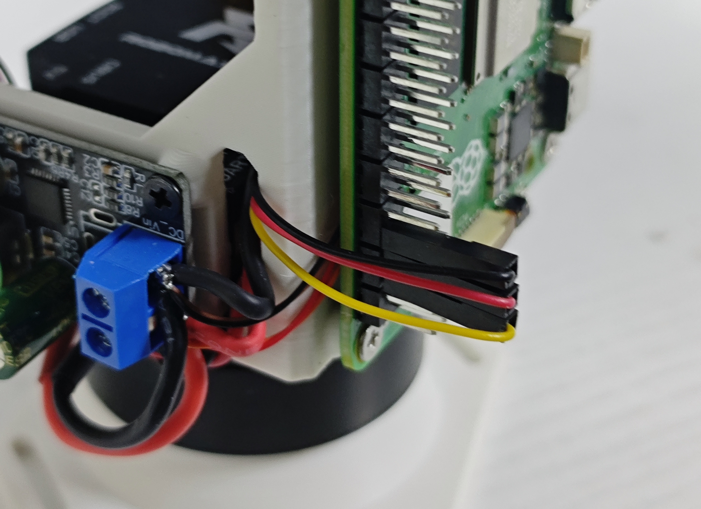

# QGimbal-vision

QGimbal云台配套视觉程序。试用 OpenCV 库实现基于传统视觉算法的白色矩形检测，将误差进行PID计算后，通过UART向QGimbal发送指令实现目标追踪。

## 运行步骤

### **1. 克隆仓库**

```bash
sudo apt install git # 若未安装git，请先安装
git clone https://github.com/Liu-Curiousity/QGimbal-Vision.git # 克隆仓库
cd QGimbal-Vision # 进入仓库目录
```

### **2. 安装依赖环境**

```bash
pip install -r requirements.txt # 使用pip安装
sudo apt install python3-opencv # 若pip安装opencv失败，可尝试apt安装
```

### **3. 连接并配置串口**

- 板载40P串口连接示意图（线序以[树莓派引脚定义](https://pinout.vvzero.com/)和[QGimbal使用手册](https://qdrive.com.cn/downloads/solutions/qgimbal/QGimbal%E4%BD%BF%E7%94%A8%E6%89%8B%E5%86%8C.pdf)的定义为准）：
- 若使用树莓派40P引脚中的串口，需先使用`raspi-config`工具启用串口，具体步骤如下。开启后串口对应设备为`/dev/ttyAMA0`
  1. `sudo raspi-config`
  2. 选择`Interface Options`
  3. 选择`Serial Port`
  4. 选择`Yes` `Yes` `Yes`启用串口硬件
  5. 选择`Finish`，重启树莓派
- 若使用其他Linux开发板，如：香橙派、地瓜派等，40P引脚的串口开启方式和接线顺序可能不同，请参考对应开发板的官方文档
- 若使用USB转TTL模块连接QGimbal，请确保模块已正确连接到树莓派，并记下对应的串口号（如`/dev/ttyUSB0`）

### **4. 运行程序**

选择其中一种模式运行：

- 窗口模式：显示摄像头图像，便于调试和观察识别效果，但帧率较低
- 无窗口模式：不显示摄像头图像，进通过终端输出基本信息，帧率高

**注意：** 若使用SSH远程连接时选择窗口模式运行，请确保SSH客户端支持X11转发，并在连接时使用`ssh -X`参数。

```bash
# 窗口模式，使用40P串口ttyAMA0，按 `q` 或 `ESC` 退出
python main.py --serial-port /dev/ttyAMA0 --display 1
```

```bash
# 无窗口模式，使用40P串口ttyAMA0，按 `Ctrl+C` 退出
python main.py --serial-port /dev/ttyAMA0 --display 0
```

## 说明

- 图像坐标：x 向右为正，y 向下为正
- 误差定义：`err = current_center - target_center`
- 若激光点不在追踪目标处，可以更改`main.py`中的
  `tracker.target_center = (frame.shape[:2][1] // 2 + 10, frame.shape[:2][0] // 2)`调整`target_center`，使其与激光点实际位置一致。
- 更多参数可使用`python main.py --help`查看
- **强烈建议：** 在运行此视觉代码前，先按照[QGimbal使用手册](https://qdrive.com.cn/downloads/solutions/qgimbal/QGimbal%E4%BD%BF%E7%94%A8%E6%89%8B%E5%86%8C.pdf)“上位机调参”的章节步骤，将QGimbal云台参数配置成[QGimbal装配手册](https://qdrive.com.cn/downloads/solutions/qgimbal/QGimbal%E8%A3%85%E9%85%8D%E6%89%8B%E5%86%8C.pdf)“设置云台参数”章节的参数。